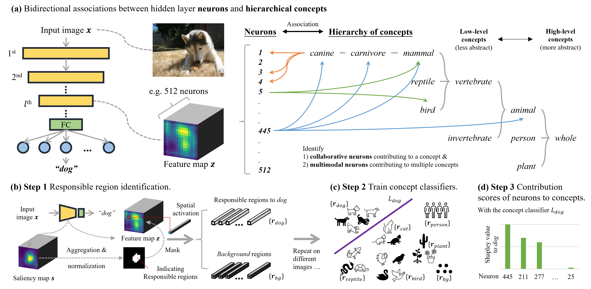
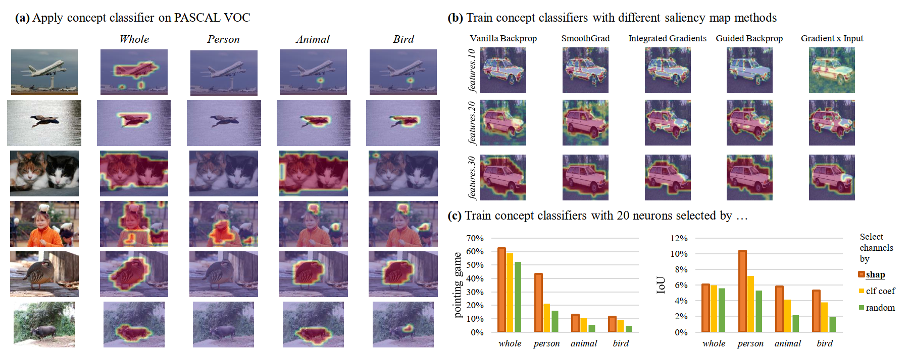

# HINT

PyTorch implementation for the paper:

> [**HINT: Hierarchical Neuron Concept Explainer**](https://arxiv.org/abs/2203.14196), ***CVPR 2022***.

To interpret deep networks, one main approach is to associate neurons with human-understandable concepts. However, existing methods often ignore the inherent relationships of different concepts (e.g., dog and cat both belong to animals), and thus lose the chance to explain neurons responsible for higher-level concepts (e.g., animal). In this paper, we study hierarchical concepts inspired by the hierarchical cognition process of human beings. To this end, we propose HIerarchical Neuron concepT explainer (HINT) to effectively build bidirectional associations between neurons and hierarchical concepts in a low-cost and scalable manner. HINT enables us to systematically and quantitatively study whether and how the implicit hierarchical relationships of concepts are embedded into neurons, such as identifying collaborative neurons responsible to one concept and multimodal neurons for different concepts, at different semantic levels from concrete concepts (e.g., dog) to more abstract ones (e.g., animal). Finally, we verify the faithfulness of the associations using Weakly Supervised Object Localization, and demonstrate its applicability in various tasks such as discovering saliency regions and explaining adversarial attacks.

## Pipeline

<p align="center">

</p>

## Dependencies

- Check the required python packages in `requirements.txt`.

## Run

- Execute ```Get_feature_maps_and_saliency_maps_of_dif_concepts.py``` to get feature maps and saliency maps (the images are from ImageNet train set) of the chosen layer(s) of the chosen model(s) (pre-trained on ImageNet).

- Based on previous step, execute ```Get_responsible_regions.py``` to get the responsible regions of different concepts.

- Run ```Get_concept_classifiers_and_shap_values.ipynb``` to train concept classifiers and calculate Shapley Values of neurons (which indicates neuron contribution to concept).

- Run ```Object_localization_using_concept_classifier_ILSVRC.ipynb```, ```Object_localization_using_concept_classifier_PASCAL_VOC.ipynb```, and ```Object_localization_using_concept_classifier_CUB-200-2011.ipynb``` to see the performance of object localization using concept classifiers (see folder ```output/concept_clf```) on different datasets.

## Datasets

- **ImageNet**

I put ImageNet dataset under ```/data/ImageNet_ILSVRC2012/```

```
/data/ImageNet_ILSVRC2012/
    /ILSVRC2012_train
        /n07715103
            n07715103_8433.JPEG
            ...
        ...
    /val
        ILSVRC2012_val_00040001.JPEG
        ILSVRC2012_val_00040001.xml
        ...
    ...
```

- [**ImageNet sample data**](https://connecthkuhk-my.sharepoint.com/:f:/g/personal/wangad_connect_hku_hk/Eq8McsVdkAdDjLpH00DUV64Bife_YQotPMMfQAomwFTimg?e=m0E4IG) (with password ```2333```)

I put it under ```/data/imagenet_sample_5000/```

- **Pascal VOC**

I put Pascal VOC dataset under ```/data/Pascal_VOC_dataset/VOCdevkit/VOC2007$``` (the path name may seem wired...)

```
/data/Pascal_VOC_dataset/VOCdevkit/VOC2007
    /Annotations
        009279.xml
        ...
    /ImageSets
        /Layout
        /Main
        /Segmentation
    /JPEGImages
        009279.jpg
        ...
    /SegmentationClass
        001457.png
        ...
    /SegmentationObject
        009654.png
        ...
```

- **CUB-200-2011**

I put CUB-200-2011 dataset under ```/data/CUB-200-2011$```

```
/data/CUB-200-2011
    /CUB_200_2011
        /attributes
        bounding_boxes.txt
        classes.txt
        image_class_labels.txt
        /images
            /001.Black_footed_Albatross
                Black_Footed_Albatross_0001_796111.jpg
                ...
            ...
        images.txt
        /parts
        README
        train_test_split.txt
    /segmentations
        /001.Black_footed_Albatross
            Black_Footed_Albatross_0001_796111.png
            ...
        ...
    attributes.txt
    README.txt
```

## Results

### Responsible neurons for hierarchical concepts

<p align="center">

</p>

### Object localization

<p align="center">

</p>

## Contact

If you have any questions, please contact ```wangad@connect.hku.hk```.
